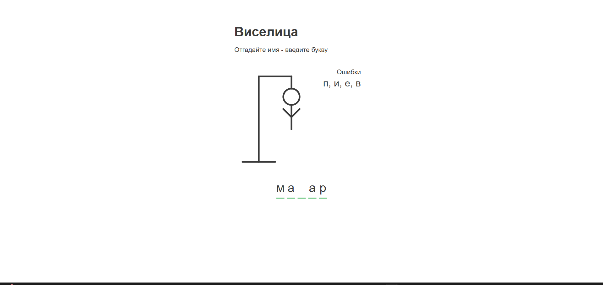
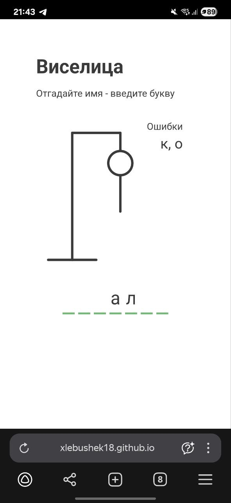

# Игра Виселица - угадай имя

Учебный проект на Vue 3 (Composition API) и TypeScript. Угадай имя персонажа по буквам! [(Демонстрация игры)](https://xlebushek18.github.io/gallows-game/)

## 📖 О проекте

Этот проект представляет собой современную веб-реализацию классической игры "Виселица" с фокусом на угадывании имен.

## ✨ Возможности

- 🎯 Угадывание имен
- 📊 Визуализация прогресса (рисунок виселицы)
- 💡 Интеллектуальные подсказки

## Стек

- Vue 3 (Composition API)
- TypeScript
- HTML
- CSS
- Axios

## 📸 Скриншоты

### Основной интерфейс


### Мобильная версия


## 🚀 Запуск проекта

### Project setup
```
npm install
```

### Compiles and hot-reloads for development
```
npm run serve
```

### Compiles and minifies for production
```
npm run build
```

### Lints and fixes files
```
npm run lint
```

